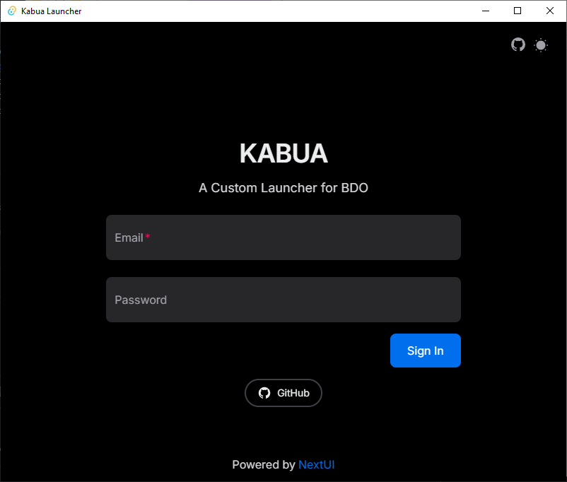

Kabua's Launcher

## :warning: **`WIP - This repository is at the early stage.`**    
## Description
A Custom launcher to quickly login and start the game for SEA/TH region.   
<div align='center'>
    
</div>   

## How to use
- Download the installer from [release](https://github.com/farhannz/kabua/releases) page. 

# Build

## Prerequisites
- Rust
- Node.js
- pnpm

## How to build
* Clone this repository
```sh
git clone https://github.com/farhannz/kabua.git && \
cd kabua
```
* Install node dependencies
```sh
pnpm install
```
* Start developing
```sh
pnpm tauri dev
```
* or to build the app
```sh
pnpm tauri build
```

## Known limitations
- No OTP Support
- No Steam Support
- No Captcha Solver